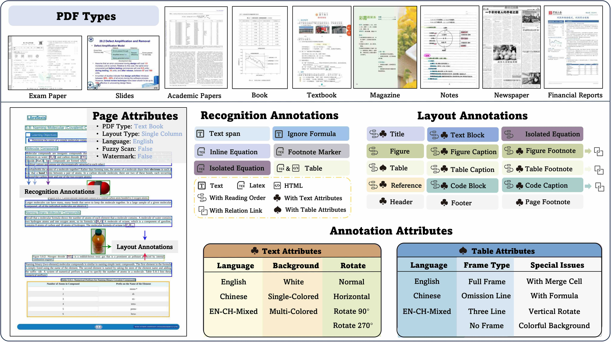
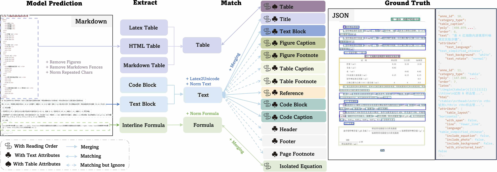

<h1 align="center">
OmniDocBench
</h1>

<div align="center">
<a href="./README.md">English</a> | 简体中文

[\[📜 arXiv\]](https://arxiv.org/abs/2412.07626) | [[Dataset (🤗Hugging Face)]](https://huggingface.co/datasets/opendatalab/OmniDocBench) | [[Dataset (OpenDataLab)]](https://opendatalab.com/OpenDataLab/OmniDocBench)| [[Official Site (OpenDataLab)]](https://opendatalab.com/omnidocbench)
</div>

**OmniDocBench**是一个针对真实场景下多样性文档解析评测集，具有以下特点：
- **文档类型多样**：该评测集涉及1651个PDF页面，涵盖10种文档类型、5种排版类型和5种语言类型。覆盖面广，包含学术文献、财报、报纸、教材、手写笔记等；
- **标注信息丰富**：包含28个block级别（文本段落、标题、表格等）和4个Span级别（文本行、行内公式、角标等，总量超过80k）的文档元素的**定位信息**，以及每个元素区域的**识别结果**（文本Text标注，公式LaTeX标注，表格包含LaTeX和HTML两种类型的标注）。OmniDocBench还提供了各个文档组件的**阅读顺序**的标注。除此之外，在页面和block级别还包含多种属性标签，标注了5种**页面属性标签**、3种**文本属性标签**和6种**表格属性标签**。
- **标注质量高**：经过人工筛选，智能标注，人工标注及全量专家质检和大模型质检，数据质量较高。
- **配套评测代码**：设计端到端评测及单模块评测代码，保证评测的公平性及准确性。

可进行以下几个维度的评测：
- 端到端评测：包括end2end和md2md两种评测方式
- Layout检测
- 表格识别
- 公式识别
- 文本OCR

目前支持的metric包括：
- Normalized Edit Distance
- BLEU
- METEOR
- TEDS
- COCODet (mAP, mAR, etc.)

## 目录

- [目录](#目录)
- [更新](#更新)
- [评测集介绍](#评测集介绍)
- [评测](#评测)
  - [环境配置和运行](#环境配置和运行)
    - [验证版本](#验证版本)
    - [Worker 并发配置](#worker-并发配置)
    - [运行评测](#运行评测)
  - [端到端评测](#端到端评测)
    - [端到端评测方法-end2end](#端到端评测方法-end2end)
    - [端到端评测方法-md2md](#端到端评测方法-md2md)
  - [公式识别评测](#公式识别评测)
  - [文字OCR评测](#文字ocr评测)
  - [表格识别评测](#表格识别评测)
  - [Layout检测](#layout检测)
  - [公式检测](#公式检测)
- [工具](#工具)
- [评测模型信息](#评测模型信息)
  - [End2End](#end2end)
  - [Text Recognition](#text-recognition)
  - [Layout](#layout)
  - [Formula](#formula)
  - [Table](#table)
- [TODO](#todo)
- [Known Issues](#known-issues)
- [Acknowledgement](#acknowledgement)
- [版权声明](#版权声明)
- [引用](#引用)

## 更新
[2026/04/30] 从版本**v1.6** 更新到 **v1.7**,新增QianfanOCR的榜单,支持skills方式评测。

[2026/04/09] **重大版本更新**：从版本**v1.5** 更新到 **v1.6**
  - 评测代码：(1) 我们提出 **Multi-Granularity Adaptive Matching (MGAM)**，通过对预测端进行自适应粒度调整来消除匹配偏差。核心设计原则是：保持 ground truth 不变，仅在预测端搜索最优分段粒度。(2) 为优化CDM的部署，将node.js、katex等依赖包用python版本重写并替换，速度优化3倍左右。
  - 评测集：(1) 新增 **296** 页样本， 样本选取旨在覆盖文档解析中更具挑战性的场景类别，包括复杂嵌套表格、密集数学公式排版、非常规版面结构等; (2) 修正了1.5版本表格、公式、OCR部分标注；
  - 注意：评测代码（本repo）和评测集（HuggingFace和OpenDataLab）的`main`分支已经更新到版本**v1.6**，如果仍想使用v1.0版本的代码和评测集，请切换到特定分支。

[2026/03/31] 更新了PaddleOCR-VL-1.5、Youtu-Parsing、FireRed-OCR、Logics-Parsing-v2、Ovis2.6-30B-A3B、MinerU2.5、HunyuanOCR、FD-RL、DeepSeek-OCR-2、MonkeyOCR-pro-3B、OCRVerse、dots.ocr、Dolphin-v2、MonkeyOCR-Pro-3B、POINTS-Reader、Gemini-3 Flash、Gemini-3 Pro、Kimi 2.5、GPT5.2、GPT-4o、InternVL3.5、GLM-OCR、OpenDoc 和 Mathpix 的模型评测结果，新增了上述榜单模型的推理代码。

[2025/11/04] 增加docker运行环境，包含评测环境和CDM环境。

[2025/10/28] 更新PaddleOCR-VL, Qwen3-VL-235B-A22B-Instruct, Deepseek-OCR, Dolphin-1.5模型评测结果。

[2025/09/25] **重大版本更新**：从版本**v1.0** 更新到 **v1.5**
  - 评测代码：（1）更新了**混合匹配**方案，使公式和文本之间也可以进行匹配，从而缓解了模型将公式写成unicode后造成的分数误差；（2）将**CDM**的计算直接写入metric部分，用户如果有CDM环境可以直接通过在config文件中配置`CDM`计算出指标，另外，仍保留了之前输出公式匹配对JSON文件的接口，命名为`CDM_plain`;
  - 评测集：（1）报纸和笔记类型的图片从72DPI提升到**200DPI**；（2）**新增374个页面**，平衡了中英文页面的数量，并提升了包含公式页面的占比；（3）公式新增语种属性；（4）修复部分文本和表格的标注错别字；
  - 榜单：（1）去除了中英文的分组，直接计算的是所有页面的平均分；（2）**Overall**指标的计算方式改为 ((1-文本编辑距离)*100 + 表格TEDS + 公式CDM)/3;
  - 注意：评测代码（本repo）和评测集（HuggingFace和OpenDataLab）的`main`分支已经更新到版本**v1.5**，如果仍想使用v1.0版本的代码和评测集，请切换分支到`v1_0`.

[2025/09/09] 使用最新Dolphin推理脚本和模型权重，更新Dolphin的评测结果，新增了Dolphin infer脚本。

[2025/08/20] 更新PP-StructureV3、MonkeyOCR-pro-1.2B模型评测结果，新增了Mistral OCR、Pix2text、phocr、Nanonets-OCR-s infer脚本。

[2025/07/31] 新增了MinerU2.0-vlm、Marker-1.7.1、PP-StructureV3、MonkeyOCR-pro-1.2B、Dolphin、Nanonets-OCR-s、OCRFlux-3B、Qwen2.5-VL-7B、InternVL3-78B模型的评测；更新了MinerU版本。

[2025/03/27] 新增了Pix2Text、Unstructured、OpenParse、Gemini-2.0 Flash、Gemini-2.5 Pro、Mistral OCR、OLMOCR、Qwen2.5-VL-72B模型的评测；

[2025/03/10] OmniDocBench被CVPR 2025接收啦！

[2025/01/16] 更新Marker、Tesseract OCR、StructEqTable版本；新增Docling、OpenOCR、EasyOCR评测；Table部分的Edit Distance计算改成用norm后的字段；新增评测模型版本信息。

## 评测集介绍

该评测集涉及1651个PDF页面，涵盖10种文档类型、5种排版类型和5种语言类型。OmniDocBench具有丰富的标注，包含28个block级别的标注（文本段落、标题、表格等）和4个Span级别的标注（文本行、行内公式、角标等）。所有文本相关的标注框上都包含文本识别的标注，公式包含LaTeX标注，表格包含LaTeX和HTML两种类型的标注。OmniDocBench还提供了各个文档组件的阅读顺序的标注。除此之外，在页面和block级别还包含多种属性标签，标注了5种页面属性标签、3种文本属性标签和6种表格属性标签。



<details>
  <summary>【评测集的数据格式】</summary>

评测集的数据格式为JSON，其结构和各个字段的解释如下：

```json
[{
    "layout_dets": [    // 页面元素列表
        {
            "category_type": "text_block",  // 类别名称
            "poly": [
                136.0, // 位置信息，分别是左上角、右上角、右下角、左下角的x,y坐标
                781.0,
                340.0,
                781.0,
                340.0,
                806.0,
                136.0,
                806.0
            ],
            "ignore": false,        // 是否在评测的时候不考虑
            "order": 0,             // 阅读顺序
            "anno_id": 0,           // 特殊的标注ID，每个layout框唯一
            "text": "xxx",          // 可选字段，OCR结果会写在这里
            "latex": "$xxx$",       // 可选字段，formula和table的LaTeX会写在这里
            "html": "xxx",          // 可选字段，table的HTML会写在这里
            "attribute" {"xxx": "xxx"},         // layout的分类属性，后文会详细展示
            "line_with_spans:": [   // span level的标注框
                {
                    "category_type": "text_span",
                    "poly": [...],
                    "ignore": false,
                    "text": "xxx",   
                    "latex": "$xxx$",
                 },
                 ...
            ],
            "merge_list": [    // 只有包含merge关系的标注框内有这个字段，是否包含merge逻辑取决于是否包含单换行分割小段落，比如列表类型
                {
                    "category_type": "text_block", 
                    "poly": [...],
                    ...   // 跟block级别标注的字段一致
                    "line_with_spans": [...]
                    ...
                 },
                 ...
            ]
        ...
    ],
    "page_info": {         
        "page_no": 0,            // 页码
        "height": 1684,          // 页面的宽
        "width": 1200,           // 页面的高
        "image_path": "xx/xx/",  // 标注的页面文件名称
        "page_attribute": {"xxx": "xxx"}     // 页面的属性标签
    },
    "extra": {
        "relation": [ // 具有相关关系的标注
            {  
                "source_anno_id": 1,
                "target_anno_id": 2, 
                "relation": "parent_son"  // figure/table与其对应的caption/footnote类别的关系标签
            },
            {  
                "source_anno_id": 5,
                "target_anno_id": 6,
                "relation_type": "truncated"  // 段落因为排版原因被截断，会标注一个截断关系标签，后续评测的时候会拼接后再作为一整个段落进行评测
            },
        ]
    }
},
...
]
```

</details>

<details>
  <summary>【验证集类别】</summary>

验证集类别包括：

```
# Block级别标注框
'title'               # 标题
'text_block'          # 段落级别纯文本
'figure',             # 图片类
'figure_caption',     # 图片说明、标题
'figure_footnote',    # 图片注释
'table',              # 表格主体
'table_caption',      # 表格说明和标题
'table_footnote',     # 表格的注释
'equation_isolated',  # 行间公式
'equation_caption',   # 公式序号
'header'              # 页眉
'footer'              # 页脚  
'page_number'         # 页码
'page_footnote'       # 页面注释
'abandon',            # 其他的舍弃类（比如页面中间的一些无关信息）
'code_txt',           # 代码块
'code_txt_caption',   # 代码块说明
'reference',          # 参考文献类

# Span级别标注框
'text_span'           # span级别的纯文本
'equation_ignore',    # 需要忽略的公式类
'equation_inline',    # 行内公式类
'footnote_mark',      #文章的上下角标
```

</details>

<details>
  <summary>【验证集属性标签】</summary>

页面分类属性包括：
```
'data_source': #PDF类型分类
    academic_literature  # 学术文献
    PPT2PDF # PPT转PDF
    book # 黑白的图书和教材
    colorful_textbook # 彩色图文教材
    exam_paper # 试卷
    note # 手写笔记
    magazine # 杂志
    research_report # 研报、财报
    newspaper # 报纸

'language':#语种
    en # 英文
    simplified_chinese # 简体中文
    en_ch_mixed # 中英混合

'layout': #页面布局类型
    single_column # 单栏
    double_column # 双栏
    three_column # 三栏
    1andmore_column # 一混多，常见于文献
    other_layout # 其他

'watermark'： # 是否包含水印
    true  
    false

'fuzzy_scan': # 是否模糊扫描
    true  
    false

'colorful_backgroud': # 是否包含彩色背景，需要参与识别的内容的底色包含两个以上
    true  
    false
```

标注框级别属性-表格相关属性:

```
'table_layout': # 表格的方向
    vertical #竖版表格
    horizontal #横版表格

'with_span': # 合并单元格
    False
    True

'line':# 表格的线框
    full_line # 全线框
    less_line # 漏线框
    fewer_line # 三线框 
    wireless_line # 无线框

'language': #表格的语种
    table_en  # 英文表格
    table_simplified_chinese  #中文简体表格
    table_en_ch_mixed  #中英混合表格

'include_equation': # 表格是否包含公式
    False
    True

'include_backgroud': # 表格是否包含底色
    False
    True

'table_vertical' # 表格是否旋转90度或270度
    False
    True
```

标注框级别属性-文本段落相关属性: 
```
'text_language': # 文本的段落内语种
    text_en  # 英文
    text_simplified_chinese #简体中文
    text_en_ch_mixed  #中英混合

'text_background':  #文本的背景色
    white # 默认值，白色背景
    single_colored # 除白色外的单背景色
    multi_colored  # 混合背景色

'text_rotate': # 文本的段落内文字旋转分类
    normal # 默认值，横向文本，没有旋转
    rotate90  # 旋转角度，顺时针旋转90度
    rotate180 # 顺时针旋转180度
    rotate270 # 顺时针旋转270度
    horizontal # 文字是正常的，排版是竖型文本
```

标注框级别属性-公式相关属性: 
```
'formula_type': #公式类型
    print  # 打印体
    handwriting # 手写体
```

</details>


## 评测

OmniDocBench开发了一套基于文档组件拆分和匹配的评测方法，对文本、表格、公式、阅读顺序这四大模块分别提供了对应的指标计算，评测结果除了整体的精度结果以外，还提供了分页面以及分属性的精细化评测结果，精准定位模型文档解析的痛点问题。



### 环境配置和运行

评测流水线需要 Python 3.10 以及若干系统依赖（TeX Live、ImageMagick、Ghostscript）以支持 CDM 公式指标。提供两种部署方式，推荐使用Docker方式：

<details>
<summary><b>方式 A：Docker（推荐）</b></summary>

预构建 Docker 镜像打包了经过验证的完整运行时（Python 3.10 conda 环境 + TeX Live 2025 + ImageMagick 7.1.1-47 + Ghostscript 9.55.0）。

**拉取镜像**

```bash
docker pull ghcr.io/zeng-weijun/omnidocbench-eval:repro-ubuntu2204
```

**使用自己的数据运行**

```bash
docker run --rm \
  --entrypoint bash \
  -v /path/to/your_gt.json:/workspace/gt/your_gt.json:ro \
  -v /path/to/your_predictions:/workspace/data_md/predictions:ro \
  -v /path/to/output:/workspace/result \
  ghcr.io/zeng-weijun/omnidocbench-eval:repro-ubuntu2204 \
  -c 'cat > configs/custom.yaml << "EOF"
end2end_eval:
  metrics:
    text_block:
      metric: [Edit_dist]
    display_formula:
      metric: [Edit_dist, CDM]
    table:
      metric: [TEDS, Edit_dist]
    reading_order:
      metric: [Edit_dist]
  dataset:
    dataset_name: end2end_dataset
    ground_truth:
      data_path: ./gt/your_gt.json
    prediction:
      data_path: ./data_md/predictions
    match_method: quick_match
    match_workers: 4
    quick_match_truncated_timeout_sec: 300
    timeout_fallback_max_chunk_span: 10
    timeout_fallback_order_penalty: 0.10
EOF
python pdf_validation.py --config configs/custom.yaml'
```

**验证镜像内运行时**

```bash
docker run --rm --entrypoint bash \
  ghcr.io/zeng-weijun/omnidocbench-eval:repro-ubuntu2204 \
  -lc 'bash script/verify_repro_runtime.sh'
```

**从源码构建**（可选）

```bash
bash script/build_repro_docker_image.sh
```
</details>

<details>
<summary><b>方式 B：Conda</b></summary>

> 需要 Ubuntu 22.04 / 20.04，至少 8 GB 磁盘空间和 8 GB 内存，root 权限。

**第 1 步 — 创建环境并安装 Python 依赖**

```bash
conda create -n omnidocbench python=3.10 -y
conda activate omnidocbench
git clone <repo_url> && cd Omnidocbench
pip install -e .
python -c "from src.core.pipeline import run_config_file; print('OK')"
```

**第 2 步 — 安装 Ghostscript**

CDM 指标需要 Ghostscript 通过 ImageMagick 完成 PDF 到 PNG 的转换。

```bash
sudo apt-get update && sudo apt-get install -y ghostscript
gs --version   # 预期: 9.55.0 (Ubuntu 22.04)
```

**第 3 步 — 安装 TeX Live 2025**

CDM 指标需要 `pdflatex` 并支持 CJK 中文字体。

```bash
cd ~ && wget http://mirror.ctan.org/systems/texlive/tlnet/install-tl-unx.tar.gz
tar -xzf install-tl-unx.tar.gz && cd install-tl-*/
sudo ./install-tl   # 交互式安装，全量约 7 GB

echo 'export PATH=/usr/local/texlive/2025/bin/x86_64-linux:$PATH' >> ~/.bashrc
source ~/.bashrc
pdflatex --version | head -2   # 预期: pdfTeX ... (TeX Live 2025)

# 验证 CJK 支持
kpsewhich CJK.sty && kpsewhich c70gkai.fd
# 如果没有输出: sudo tlmgr install cjk cjkutils arphic gkai
```

**第 4 步 — 安装 ImageMagick 7.x**（从源码编译）

Ubuntu 22.04 apt 默认是 ImageMagick 6.x，CDM 需要 7.x。

```bash
sudo apt-get install -y build-essential pkg-config \
  libjpeg-dev libpng-dev libtiff-dev libwebp-dev \
  libfreetype6-dev libfontconfig1-dev

cd /tmp
wget https://github.com/ImageMagick/ImageMagick/archive/refs/tags/7.1.1-47.tar.gz
tar xzf 7.1.1-47.tar.gz && cd ImageMagick-7.1.1-47
./configure --with-modules --enable-shared --with-gslib \
  --with-gs-font-dir=/usr/share/fonts/type1/gsfonts --prefix=/usr/local
make -j$(nproc) && sudo make install && sudo ldconfig
magick --version | head -2   # 预期: ImageMagick 7.1.1-47

# 允许 PDF 读写
POLICY_FILE=$(find /usr/local/etc/ImageMagick-7 -name policy.xml 2>/dev/null | head -1)
[ -n "$POLICY_FILE" ] && sudo sed -i \
  's|<policy domain="coder" rights="none" pattern="PDF" />|<policy domain="coder" rights="read\|write" pattern="PDF" />|' \
  "$POLICY_FILE"
```

**第 5 步 — 验证并运行**

```bash
python -m pytest tools/test_environment_and_smoke.py::TestEnvironmentVersions -v -s
python pdf_validation.py --config configs/end2end.yaml
```

</details>

#### 验证版本

| 组件 | 版本 |
|------|------|
| Python | 3.10.x |
| TeX Live | 2025 |
| pdflatex | 3.141592653-2.6-1.40.28 |
| ImageMagick | 7.1.1-47 |
| Ghostscript | 9.55.0 |

#### Worker 并发配置

评测流水线有三个并行阶段，建议每个阶段的 worker 数设为机器空闲线程数的 1/3 ~ 1/2，避免死锁或 OOM：

| 阶段 | 配置项 | 说明 |
|------|--------|------|
| 页面匹配 | `match_workers` | 文本对齐 |
| CDM 渲染 | `cdm_workers` | 每个 worker 约 1 GB 内存 |
| TEDS 表格 | `teds_workers` | 表格结构相似度 |

#### 运行评测

所有评测输入通过 [configs/end2end.yaml](./configs/end2end.yaml) 配置。修改 `ground_truth.data_path` 和 `prediction.data_path` 指向你的数据，然后运行：

```bash
python pdf_validation.py --config <config_path>
```
</details>

<details>
<summary><b> 方式C：skills </b></summary>
```bash
 我需要用omnidocbench做xx模型的评测，用docker部署，GT路径是/path/OmniDocBench.json，预测结果路径是/path/predfolder，需要CDM，请帮我跑分
```
</details>


### 端到端评测

端到端评测是对模型在PDF页面内容解析上的精度作出的评测。以模型输出的对整个PDF页面解析结果的Markdown作为Prediction。Overall指标的计算方式为:

$$\text{Overall} = \frac{(1-\textit{Text Edit Distance}) \times 100 + \textit{Table TEDS} +\textit{Formula CDM}}{3}$$

<table style="width:100%; border-collapse: collapse;">
    <caption>Comprehensive evaluation of document parsing on OmniDocBench (v1.6_full)</caption>
    <thead>
        <tr>
            <th>Model Type</th>
            <th>Methods</th>
            <th>Size</th>
            <th>Overall&#x2191;</th>
            <th>Text<sup>Edit</sup>&#x2193;</th>
            <th>Formula<sup>CDM</sup>&#x2191;</th>
            <th>Table<sup>TEDS</sup>&#x2191;</th>
            <th>Table<sup>TEDS-S</sup>&#x2191;</th>
            <th>Read Order<sup>Edit</sup>&#x2193;</th>
        </tr>
    </thead>
    <tbody>
        <tr>
            <td>MinerU2.5-Pro</td>
            <td>Specialized VLMs</td>
            <td>1.2B</td>
            <td><strong>95.75</strong></td>
            <td><ins>0.036<ins></td>
            <td><strong>97.45</strong></td>
            <td><strong>93.42</strong></td>
            <td><strong>95.92</strong></td>
            <td><ins>0.120<ins></td>
        </tr>
        <tr>    
            <td>GLM-OCR</td>
            <td>Specialized VLMs</td>
            <td>0.9B</td>
            <td><ins>95.22<ins></td>
            <td>0.044</td>
            <td><ins>97.18<ins></td>
            <td><ins>92.83<ins></td>
            <td><ins>95.39<ins></td>
            <td>0.133</td>
        </tr>
        <tr>    
            <td>PaddleOCR-VL-1.5</td>
            <td>Specialized VLMs</td>
            <td>0.9B</td>
            <td>94.93</td>
            <td>0.038</td>
            <td>96.89</td>
            <td>91.67</td>
            <td>94.37</td>
            <td>0.130</td>
        </tr>
        <tr>    
            <td>PaddleOCR-VL</td>
            <td>Specialized VLMs</td>
            <td>0.9B</td>
            <td>94.18</td>
            <td>0.040</td>
            <td>95.91</td>
            <td>90.65</td>
            <td>93.74</td>
            <td>0.135</td>
        </tr>
        <tr>
            <td>Youtu-Parsing</td>
            <td>Specialized VLMs</td>
            <td>2.5B</td>
            <td>93.74</td>
            <td>0.044</td>
            <td>93.63</td>
            <td>92.02</td>
            <td>95.00</td>
            <td><strong>0.116<strong></td>
        </tr>
        <tr>
            <td>Qianfan-OCR</td>
            <td>Specialized VLMs</td>
            <td>4B</td>
            <td>93.90</td>
            <td>0.04</td>
            <td>95.08</td>
            <td>90.53</td>
            <td>93.31</td>
            <td>0.13</td>
        </tr>
        <tr>
            <td>Ovis2.6-30B-A3B</td>
            <td>General VLMs</td>
            <td>30B</td>
            <td>93.70</td>
            <td><strong>0.035<strong></td>
            <td>95.17</td>
            <td>89.44</td>
            <td>92.40</td>
            <td>0.135</td>
        </tr>
        <tr>
            <td>Logics-Parsing-v2</td>
            <td>Specialized VLMs</td>
            <td>4B</td>
            <td>93.33</td>
            <td>0.041</td>
            <td>95.65</td>
            <td>88.42</td>
            <td>91.98</td>
            <td>0.137</td>
        </tr>
         <tr>
            <td>ABot-OCR</td>
            <td>Specialized VLMs</td>
            <td>2B</td>
            <td>93.30</td>
            <td>0.037</td>
            <td>94.86</td>
            <td>88.69</td>
            <td>91.87</td>
            <td>0.137</td>
        </tr>
        <tr>
            <td>FireRed-OCR</td>
            <td>Specialized VLMs</td>
            <td>2B</td>
            <td>93.26</td>
            <td>0.037</td>
            <td>95.44</td>
            <td>88.04</td>
            <td>91.06</td>
            <td>0.131</td>
        </tr>
        <tr>
            <td>MinerU-2.5</td>
            <td>Specialized VLMs</td>
            <td>1.2B</td>
            <td>93.04</td>
            <td>0.045</td>
            <td>95.77</td>
            <td>87.88</td>
            <td>91.47</td>
            <td>0.130</td>
        </tr>
        <tr>
            <td>Gemini 3 Pro</td>
            <td>General VLMs</td>
            <td>-</td>
            <td>92.91</td>
            <td>0.064</td>
            <td>95.99</td>
            <td>89.15</td>
            <td>92.96</td>
            <td>0.165</td>
        </tr>
        <tr>
            <td>Gemini 3 Flash</td>
            <td>General VLMs</td>
            <td>-</td>
            <td>92.62</td>
            <td>0.066</td>
            <td>95.16</td>
            <td>89.29</td>
            <td>93.51</td>
            <td>0.172</td>
        </tr>
        <tr>
            <td>dots.ocr</td>
            <td>Specialized VLMs</td>
            <td>3B</td>
            <td>90.77</td>
            <td>0.048</td>
            <td>89.95</td>
            <td>87.18</td>
            <td>90.58</td>
            <td>0.138</td>
        </tr>
        <tr>
            <td>OpenDoc-0.1B</td>
            <td>Specialized VLMs</td>
            <td>0.1B</td>
            <td>90.67</td>
            <td>0.049</td>
            <td>93.02</td>
            <td>83.88</td>
            <td>87.45</td>
            <td>0.140</td>
        </tr>
        <tr>
            <td>DeepSeek-OCR 2</td>
            <td>Specialized VLMs</td>
            <td>3B</td>
            <td>90.25</td>
            <td>0.050</td>
            <td>91.84</td>
            <td>83.89</td>
            <td>87.75</td>
            <td>0.144</td>
        </tr>
        <tr>
            <td>HunyuanOCR</td>
            <td>Specialized VLMs</td>
            <td>1B</td>
            <td>89.95</td>
            <td>0.088</td>
            <td>87.68</td>
            <td>91.01</td>
            <td>93.23</td>
            <td>0.171</td>
        </tr>
        <tr>
            <td>Qwen3-VL-235B</td>
            <td>General VLMs</td>
            <td>235B</td>
            <td>89.78</td>
            <td>0.063</td>
            <td>92.55</td>
            <td>83.07</td>
            <td>86.75</td>
            <td>0.166</td>
        </tr>
        <tr>
            <td>Dolphin-v2</td>
            <td>Specialized VLMs</td>
            <td>3B</td>
            <td>89.50</td>
            <td>0.069</td>
            <td>91.01</td>
            <td>84.40</td>
            <td>87.44</td>
            <td>0.150</td>
        </tr>
        <tr>
            <td>OCRVerse</td>
            <td>Specialized VLMs</td>
            <td>4B</td>
            <td>88.60</td>
            <td>0.063</td>
            <td>89.61</td>
            <td>82.44</td>
            <td>86.27</td>
            <td>0.163</td>
        </tr>
        <tr>
            <td>MonkeyOCR-pro-3B</td>
            <td>Specialized VLMs</td>
            <td>3B</td>
            <td>88.57</td>
            <td>0.074</td>
            <td>88.74</td>
            <td>84.35</td>
            <td>88.62</td>
            <td>0.189</td>
        </tr>
        <tr>
            <td>GPT-5.2</td>
            <td>General VLMs</td>
            <td>-</td>
            <td>86.59</td>
            <td>0.114</td>
            <td>88.21</td>
            <td>82.95</td>
            <td>87.93</td>
            <td>0.193</td>
        </tr>
        <tr>
            <td>Dolphin-1.5</td>
            <td>Specialized VLMs</td>
            <td>0.3B</td>
            <td>86.52</td>
            <td>0.094</td>
            <td>87.49</td>
            <td>81.43</td>
            <td>84.82</td>
            <td>0.167</td>
        </tr>
        <tr>
            <td>MinerU-Pipeline</td>
            <td>Pipeline Tools</td>
            <td>-</td>
            <td>86.47</td>
            <td>0.055</td>
            <td>83.07</td>
            <td>81.88</td>
            <td>88.68</td>
            <td>0.153</td>
        </tr>
        <tr>
            <td>olmOCR</td>
            <td>Specialized VLMs</td>
            <td>7B</td>
            <td>85.74</td>
            <td>0.139</td>
            <td>88.10</td>
            <td>83.00</td>
            <td>87.17</td>
            <td>0.216</td>
        </tr>
        <tr>
            <td>Mistral OCR</td>
            <td>Specialized VLMs</td>
            <td>-</td>
            <td>85.66</td>
            <td>0.097</td>
            <td>89.91</td>
            <td>76.78</td>
            <td>80.93</td>
            <td>0.171</td>
        </tr>
        <tr>
            <td>Kimi K2.5</td>
            <td>General VLMs</td>
            <td>1T</td>
            <td>84.53</td>
            <td>0.107</td>
            <td>83.50</td>
            <td>80.76</td>
            <td>84.00</td>
            <td>0.211</td>
        </tr>
        <tr>
            <td>InternVL3.5-241B</td>
            <td>General VLMs</td>
            <td>241B</td>
            <td>83.76</td>
            <td>0.130</td>
            <td>89.95</td>
            <td>74.35</td>
            <td>79.78</td>
            <td>0.215</td>
        </tr>
        <tr>
            <td>Nanonets-OCR-s</td>
            <td>Specialized VLMs</td>
            <td>3B</td>
            <td>83.61</td>
            <td>0.108</td>
            <td>81.46</td>
            <td>80.18</td>
            <td>84.51</td>
            <td>0.213</td>
        </tr>
        <tr>
            <td>POINTS-Reader</td>
            <td>Specialized VLMs</td>
            <td>3B</td>
            <td>83.37</td>
            <td>0.096</td>
            <td>85.72</td>
            <td>73.98</td>
            <td>77.40</td>
            <td>0.198</td>
        </tr>
        <tr>
            <td>Marker</td>
            <td>Pipeline Tools</td>
            <td>-</td>
            <td>78.44</td>
            <td>0.157</td>
            <td>85.24</td>
            <td>65.77</td>
            <td>73.24</td>
            <td>0.243</td>
        </tr>
    </tbody>
</table>


更多分属性评测结果在论文中展示。或者你可以使用[tools/generate_result_tables.ipynb](./tools/generate_result_tables.ipynb)来生成结果的leaderboard。

#### 端到端评测方法-end2end

端到端评测分为两种方式：
- `end2end`: 该方法是用OmniDocBench的JSON文件作为Ground Truth, config文件请参考：[end2end](./configs/end2end.yaml)
- `md2md`: 该方法是用OmniDocBench的markdown格式作为Ground Truth。具体内容将在下一小节*markdown-to-markdown评测*中详述。

我们推荐使用`end2end`的评测方式，因为该方式可以保留sample的类别和属性信息，从而帮助进行特殊类别ignore的操作，以及分属性的结果输出。

`end2end`的评测可以对四个维度进行评测，我们提供了一个end2end的评测结果示例在[result](./result)中，包括:
- 文本段落
- 行间公式
- 表格
- 阅读顺序

<details>
  <summary>【end2end.yaml的字段解释】</summary>

`end2end.yaml`的配置如下：

```YAML
end2end_eval:          # 指定task名称，端到端评测通用该task
  metrics:             # 配置需要使用的metric
    text_block:        # 针对文本段落的配置
      metric:
        - Edit_dist    # Normalized Edit Distance
        - BLEU         
        - METEOR
    display_formula:   # 针对行间公式的配置
      metric:
        - Edit_dist
        - CDM          # 仅支持导出CDM评测所需的格式，存储在results中
    table:             # 针对表格的配置
      metric:
        - TEDS
        - Edit_dist
    reading_order:     # 针对阅读顺序的配置
      metric:
        - Edit_dist
  dataset:                                       # 数据集配置
    dataset_name: end2end_dataset                # 数据集名称，无需修改
    ground_truth:
      data_path: ./demo_data/omnidocbench_demo/OmniDocBench_demo.json  # OmniDocBench的路径
    prediction:
      data_path: ./demo_data/end2end            # 模型对PDF页面解析markdown结果的文件夹路径
    match_method: quick_match                    # 匹配方式，可选有: no_split/no_split/quick_match
    filter:                                      # 页面级别的筛选
      language: english                          # 需要评测的页面属性以及对应标签
```

`prediction`下的`data_path`输入的是模型对PDF页面解析结果的文件夹路径，路径中保存的是每个页面对应的markdown，文件名与图片名保持一致，仅将.jpg后缀替换成.md。

目前[CDM](https://github.com/opendatalab/UniMERNet/tree/main/cdm)已支持直接评测，需要根据[README](./metrics/cdm/README-CN.md)配置CDM环境后使用，并且在config文件中直接调用`CDM`。除此之外，仍然保留了之前导出CDM评测所需的格式的JSON文件，只需要在metric中配置`CDM_plain`字段，即可将输出整理为CDM的输入格式，并存储在[result](./result)中。

在端到端的评测中，config里可以选择配置不同的匹配方式，一共有三种匹配方式：
- `no_split`: 不对text block做拆分和匹配的操作，而是直接合并成一整个markdown进行计算，这种方式下，将不会输出分属性的结果，也不会输出阅读顺序的结果；
- `simple_match`: 不进行任何截断合并操作，仅对文本做双换行的段落分割后，直接与GT进行一对一匹配；
- `quick_match`：在段落分割的基础上，加上截断合并的操作，减少段落分割差异对最终结果的影响，通过*Adjacency Search Match*的方式进行截断合并；目前v1.5版本在评测方法上已全面升级为**混合匹配**的方法，允许公式和文本进行匹配，减少了模型输出公式为unicode格式造成的分数影响；

我们推荐使用`quick_match`的方式以达到较好的匹配效果，但如果模型输出的段落分割较准确，也可以使用`simple_match`的方式，评测运行会更加迅速。匹配方法通过`config`中的`dataset`字段下的`match_method`字段进行配置。

使用`filter`字段可以对数据集进行筛选，比如将`dataset`下设置`filter`字段为`language: english`，将会仅评测页面语言为英文的页面。更多页面属性请参考*评测集介绍*部分。如果希望全量评测，请注释掉`filter`相关字段。

</details>


#### 端到端评测方法-md2md

markdown-to-markdown评测以模型输出的对整个PDF页面解析结果的Markdown作为Prediction，用OmniDocBench的markdown格式作为Ground Truth。config文件请参考：[md2md](https://github.com/opendatalab/OmniDocBench/blob/v1_5/configs/md2md.yaml)。我们更加推荐使用上一节的`end2end`的方式使用OmniDocBench进行评测，从而保留丰富的属性标注以及ignore逻辑。但是我们依然提供了`md2md`的评测方法，以便于与现有的评测方式对齐。

`md2md`的评测可以对三个维度进行评测，包括:
- 文本段落
- 行间公式
- 表格
- 阅读顺序

<details>
  <summary>【md2md.yaml的字段解释】</summary>

`md2md.yaml`的配置如下：

```YAML
end2end_eval:          # 指定task名称，端到端评测通用该task
  metrics:             # 配置需要使用的metric
    text_block:        # 针对文本段落的配置
      metric:
        - Edit_dist    # Normalized Edit Distance
        - BLEU         
        - METEOR
    display_formula:   # 针对行间公式的配置
      metric:
        - Edit_dist
        - CDM          # 仅支持导出CDM评测所需的格式，存储在results中
    table:             # 针对表格的配置
      metric:
        - TEDS
        - Edit_dist
    reading_order:     # 针对阅读顺序的配置
      metric:
        - Edit_dist
  dataset:                                               # 数据集配置
    dataset_name: md2md_dataset                          # 数据集名称，无需修改
    ground_truth:                                        # 针对ground truth的数据集配置
      data_path: ./demo_data/omnidocbench_demo/mds       # OmniDocBench的markdown文件夹路径
      page_info: ./demo_data/omnidocbench_demo/OmniDocBench_demo.json          # OmniDocBench的JSON文件路径，主要是用于获取页面级别的属性
    prediction:                                          # 针对模型预测结果的配置
      data_path: ./demo_data/end2end                     # 模型对PDF页面解析markdown结果的文件夹路径
    match_method: quick_match                            # 匹配方式，可选有: no_split/no_split/quick_match
    filter:                                              # 页面级别的筛选
      language: english                                  # 需要评测的页面属性以及对应标签
```

`prediction`下的`data_path`输入的是模型对PDF页面解析结果的文件夹路径，路径中保存的是每个页面对应的markdown，文件名与图片名保持一致，仅将`.jpg`后缀替换成`.md`。

`ground_truth`下的`data_path`输入的是OmniDocBench的markdown文件夹路径，与模型对PDF页面解析结果的markdown文件名一一对应。`ground_truth`下的`page_info`路径输入的是OmniDocBench的JSON文件路径，主要是用于获取页面级别的属性。如果不需要页面级别分属性的评测结果输出，也可以直接将该字段注释掉。但是，如果没有配置`ground_truth`下的`page_info`字段，就无法使用`filter`相关功能。

除此之外的config中字段的解释请参考*端到端评测-end2end*小节。

</details>

### 公式识别评测

OmniDocBench包含每个PDF页面的公式的bounding box信息以及对应的公式识别标注，因此可以作为公式识别评测的benchmark。公式包括行间公式`equation_isolated`和行内公式`equation_inline`，本repo目前提供的例子是行间公式的评测。

<table style="width: 47%;">
  <thead>
    <tr>
      <th>Models</th>
      <th>CDM</th>
      <th>ExpRate@CDM</th>
      <th>BLEU</th>
      <th>Norm Edit</th>
    </tr>
  </thead>
  <tbody>
    <tr>
      <td>GOT-OCR</td>
      <td>74.1</td>
      <td>28.0</td>
      <td>55.07</td>
      <td>0.290</td>
    </tr>
    <tr>
      <td>Mathpix</td>
      <td><ins>86.6</ins></td>
      <td>2.8</td>
      <td><b>66.56</b></td>
      <td>0.322</td>
    </tr>
    <tr>
      <td>Pix2Tex</td>
      <td>73.9</td>
      <td>39.5</td>
      <td>46.00</td>
      <td>0.337</td>
    </tr>
    <tr>
      <td>UniMERNet-B</td>
      <td>85.0</td>
      <td><ins>60.2</ins></td>
      <td><ins>60.84</ins></td>
      <td><b>0.238</b></td>
    </tr>
    <tr>
      <td>GPT4o</td>
      <td><b>86.8</b></td>
      <td><b>65.5</b></td>
      <td>45.17</td>
      <td><ins>0.282</ins></td>
    </tr>
    <tr>
      <td>InternVL2-Llama3-76B</td>
      <td>67.4</td>
      <td>54.5</td>
      <td>47.63</td>
      <td>0.308</td>
    </tr>
    <tr>
      <td>Qwen2-VL-72B</td>
      <td>83.8</td>
      <td>55.4</td>
      <td>53.71</td>
      <td>0.285</td>
    </tr>
  </tbody>
</table>
<p>Component-level formula recognition evaluation on OmniDocBench formula subset.</p>


公式识别评测可以参考[formula_recognition](https://github.com/opendatalab/OmniDocBench/blob/v1_5/configs/formula_recognition.yaml)进行配置。 

<details>
  <summary>【formula_recognition.yaml的字段解释】</summary>

`formula_recognition.yaml`的配置文件如下：

```YAML
recogition_eval:      # 指定task名称，所有的识别相关的任务通用此task
  metrics:            # 配置需要使用的metric
    - Edit_dist       # Normalized Edit Distance
    - CDM             # 仅支持导出CDM评测所需的格式，存储在results中
  dataset:                                                                   # 数据集配置
    dataset_name: omnidocbench_single_module_dataset                         # 数据集名称，如果按照规定的输入格式则不需要修改
    ground_truth:                                                            # 针对ground truth的数据集配置
      data_path: ./demo_data/recognition/OmniDocBench_demo_formula.json      # 同时包含ground truth和模型prediction结果的JSON文件
      data_key: latex                                                        # 存储Ground Truth的字段名，对于OmniDocBench来说，公式的识别结果存储在latex这个字段中
      category_filter: ['equation_isolated']                                 # 用于评测的类别，在公式识别中，评测的category_name是equation_isolated
    prediction:                                                              # 针对模型预测结果的配置
      data_key: pred                                                         # 存储模型预测结果的字段名，这个是用户自定义的
    category_type: formula                                                   # category_type主要是用于数据预处理策略的选择，可选项有：formula/text
```

`metrics`部分，除了已支持的metric以外，还支持导出[CDM](https://github.com/opendatalab/UniMERNet/tree/main/cdm)评测所需的格式，只需要在metric中配置CDM字段，即可将输出整理为CDM的输入格式，并存储在[result](./result)中。

`dataset`的部分，输入的`ground_truth`的`data_path`中的数据格式与OmniDocBench保持一致，仅对应的公式sample下新增一个自定义字段保存模型的prediction结果。通过`dataset`下的`prediction`字段下的`data_key`对存储了prediction信息的字段进行指定，比如`pred`。关于更多OmniDocBench的文件结构细节请参考`评测集介绍`小节。模型结果的输入格式可以参考[OmniDocBench_demo_formula](https://github.com/opendatalab/OmniDocBench/blob/v1_5/demo_data/recognition/OmniDocBench_demo_formula.json)，其格式为：

```JSON
[{
    "layout_dets": [    // 页面元素列表
        {
            "category_type": "equation_isolated",  // OmniDocBench类别名称
            "poly": [    // OmniDocBench位置信息，分别是左上角、右上角、右下角、左下角的x,y坐标
                136.0, 
                781.0,
                340.0,
                781.0,
                340.0,
                806.0,
                136.0,
                806.0
            ],
            ...   // 其他OmniDocBench字段
            "latex": "$xxx$",  // formula的LaTeX会写在这里
            "pred": "$xxx$",   // !! 模型的prediction结果存储在这里，由用户自定义一个新增字段，存储在与ground truth同级
            
        ...
    ],
    "page_info": {...},        // OmniDocBench页面信息
    "extra": {...}             // OmniDocBench标注间关系信息
},
...
]
```

在此提供一个模型infer的脚本供参考：

```PYTHON
import os
import json
from PIL import Image

def poly2bbox(poly):
    L = poly[0]
    U = poly[1]
    R = poly[2]
    D = poly[5]
    L, R = min(L, R), max(L, R)
    U, D = min(U, D), max(U, D)
    bbox = [L, U, R, D]
    return bbox

question = "<image>\nPlease convert this cropped image directly into latex."

with open('./demo_data/omnidocbench_demo/OmniDocBench_demo.json', 'r') as f:
    samples = json.load(f)
    
for sample in samples:
    img_name = os.path.basename(sample['page_info']['image_path'])
    img_path = os.path.join('./Docparse/images', img_name)
    img = Image.open(img_path)

    if not os.path.exists(img_path):
        print('No exist: ', img_name)
        continue

    for i, anno in enumerate(sample['layout_dets']):
        if anno['category_type'] != 'equation_isolated':   # 筛选出行间公式类别进行评测
            continue

        bbox = poly2bbox(anno['poly'])
        im = img.crop(bbox).convert('RGB')
        response = model.chat(im, question)  # 需要根据模型修改传入图片的方式
        anno['pred'] = response              # 直接在对应的annotation下新增字段存储模型的infer结果

with open('./demo_data/recognition/OmniDocBench_demo_formula.json', 'w', encoding='utf-8') as f:
    json.dump(samples, f, ensure_ascii=False)
```

</details>

### 文字OCR评测

OmniDocBench包含每个PDF页面的所有文字的bounding box信息以及对应的文字识别标注，因此可以作为OCR评测的benchmark。文本的标注包含block_level的标注和span_level的标注，都可以用于评测。本repo目前提供的例子是block_level的评测，即文本段落级别的OCR评测。

<table style="width: 90%; margin: auto; border-collapse: collapse; font-size: small;">
  <thead>
    <tr>
      <th rowspan="2">Model Type</th>
      <th rowspan="2">Model</th>
      <th colspan="3">Language</th>
      <th colspan="3">Text background</th>
      <th colspan="4">Text Rotate</th>
    </tr>
    <tr>
      <th><i>EN</i></th>
      <th><i>ZH</i></th>
      <th><i>Mixed</i></th>
      <th><i>White</i></th>
      <th><i>Single</i></th>
      <th><i>Multi</i></th>
      <th><i>Normal</i></th>
      <th><i>Rotate90</i></th>
      <th><i>Rotate270</i></th>
      <th><i>Horizontal</i></th>
    </tr>
  </thead>
  <tbody>
    <tr>
      <td rowspan="7" style="text-align: center;">Pipeline Tools<br>&<br>Expert Vision<br>Models</td>
      <td>PaddleOCR</td>
      <td>0.071</td>
      <td><b>0.055</b></td>
      <td><ins>0.118</ins></td>
      <td><b>0.060</b></td>
      <td><b>0.038</b></td>
      <td><ins>0.085</ins></td>
      <td><b>0.060</b></td>
      <td><b>0.015</b></td>
      <td><ins>0.285</ins></td>
      <td><b>0.021</b></td>
    </tr>
    <tr>
      <td>OpenOCR</td>
      <td>0.07</td>
      <td><ins>0.068</ins></td>
      <td><b>0.106</b></td>
      <td><ins>0.069</ins></td>
      <td>0.058</td>
      <td><b>0.081</b></td>
      <td><ins>0.069</ins></td>
      <td><ins>0.038</ins></td>
      <td>0.891</td>
      <td><ins>0.025</ins></td>
    </tr>
    <tr>
      <td>Tesseract-OCR</td>
      <td>0.096</td>
      <td>0.551</td>
      <td>0.250</td>
      <td>0.439</td>
      <td>0.328</td>
      <td>0.331</td>
      <td>0.426</td>
      <td>0.117</td>
      <td>0.969</td>
      <td>0.984</td>
    </tr>
    <tr>
      <td>EasyOCR</td>
      <td>0.26</td>
      <td>0.398</td>
      <td>0.445</td>
      <td>0.366</td>
      <td>0.287</td>
      <td>0.388</td>
      <td>0.36</td>
      <td>0.97</td>
      <td>0.997</td>
      <td>0.926</td>
    </tr>
    <tr>
      <td>Surya</td>
      <td>0.057</td>
      <td>0.123</td>
      <td>0.164</td>
      <td>0.093</td>
      <td>0.186</td>
      <td>0.235</td>
      <td>0.104</td>
      <td>0.634</td>
      <td>0.767</td>
      <td>0.255</td>
    </tr>
    <tr>
      <td>Mathpix</td>
      <td><ins>0.033</ins></td>
      <td>0.240</td>
      <td>0.261</td>
      <td>0.185</td>
      <td>0.121</td>
      <td>0.166</td>
      <td>0.180</td>
      <td><ins>0.038</ins></td>
      <td><b>0.185</b></td>
      <td>0.638</td>
    </tr>
    <tr>
      <td>GOT-OCR</td>
      <td>0.041</td>
      <td>0.112</td>
      <td>0.135</td>
      <td>0.092</td>
      <td><ins>0.052</ins></td>
      <td>0.155</td>
      <td>0.091</td>
      <td>0.562</td>
      <td>0.966</td>
      <td>0.097</td>
    </tr>
    <tr>
      <td rowspan="3" style="text-align: center;">Vision Language<br>Models</td>
      <td>Qwen2-VL-72B</td>
      <td>0.072</td>
      <td>0.274</td>
      <td>0.286</td>
      <td>0.234</td>
      <td>0.155</td>
      <td>0.148</td>
      <td>0.223</td>
      <td>0.273</td>
      <td>0.721</td>
      <td>0.067</td>
    </tr>
    <tr>
      <td>InternVL2-76B</td>
      <td>0.074</td>
      <td>0.155</td>
      <td>0.242</td>
      <td>0.113</td>
      <td>0.352</td>
      <td>0.269</td>
      <td>0.132</td>
      <td>0.610</td>
      <td>0.907</td>
      <td>0.595</td>
    </tr>
    <tr>
      <td>GPT4o</td>
      <td><b>0.020</b></td>
      <td>0.224</td>
      <td>0.125</td>
      <td>0.167</td>
      <td>0.140</td>
      <td>0.220</td>
      <td>0.168</td>
      <td>0.115</td>
      <td>0.718</td>
      <td>0.132</td>
    </tr>
  </tbody>
</table>
<p>Component-level OCR text recognition evaluation on OmniDocBench (v1.0) text subset.</p>


文字OCR评测可以参考[ocr](https://github.com/opendatalab/OmniDocBench/blob/v1_5/configs/ocr.yaml)进行配置。 

<details>
  <summary>【ocr.yaml的字段解释】</summary>

`ocr.yaml`的配置文件如下：

```YAML
recogition_eval:      # 指定task名称，所有的识别相关的任务通用此task
  metrics:            # 配置需要使用的metric
    - Edit_dist       # Normalized Edit Distance
    - BLEU
    - METEOR
  dataset:                                                                   # 数据集配置
    dataset_name: omnidocbench_single_module_dataset                         # 数据集名称，如果按照规定的输入格式则不需要修改
    ground_truth:                                                            # 针对ground truth的数据集配置
      data_path: ./demo_data/recognition/OmniDocBench_demo_text_ocr.json     # 同时包含ground truth和模型prediction结果的JSON文件
      data_key: text                                                         # 存储Ground Truth的字段名，对于OmniDocBench来说，文本识别结果存储在text这个字段中，所有block level只要包含text字段的annotations都会参与评测
    prediction:                                                              # 针对模型预测结果的配置
      data_key: pred                                                         # 存储模型预测结果的字段名，这个是用户自定义的
    category_type: text                                                      # category_type主要是用于数据预处理策略的选择，可选项有：formula/text
```

`dataset`的部分，输入的`ground_truth`的`data_path`中的数据格式与OmniDocBench保持一致，仅对应的含有text字段的sample下新增一个自定义字段保存模型的prediction结果。通过`dataset`下的`prediction`字段下的`data_key`对存储了prediction信息的字段进行指定，比如`pred`。数据集的输入格式可以参考[OmniDocBench_demo_text_ocr](https://github.com/opendatalab/OmniDocBench/blob/v1_5/demo_data/recognition/OmniDocBench_demo_text_ocr.json)，各个字段含义可以参考*公式识别评测*部分提供的样例。

在此提供一个模型infer的脚本供参考：

```PYTHON
import os
import json
from PIL import Image

def poly2bbox(poly):
    L = poly[0]
    U = poly[1]
    R = poly[2]
    D = poly[5]
    L, R = min(L, R), max(L, R)
    U, D = min(U, D), max(U, D)
    bbox = [L, U, R, D]
    return bbox

question = "<image>\nPlease convert this cropped image directly into latex."

with open('./demo_data/omnidocbench_demo/OmniDocBench_demo.json', 'r') as f:
    samples = json.load(f)
    
for sample in samples:
    img_name = os.path.basename(sample['page_info']['image_path'])
    img_path = os.path.join('./Docparse/images', img_name)
    img = Image.open(img_path)

    if not os.path.exists(img_path):
        print('No exist: ', img_name)
        continue

    for i, anno in enumerate(sample['layout_dets']):
        if not anno.get('text'):             # 筛选出OmniDocBench中包含text字段的annotations进行模型infer
            continue

        bbox = poly2bbox(anno['poly'])
        im = img.crop(bbox).convert('RGB')
        response = model.chat(im, question)  # 需要根据模型修改传入图片的方式
        anno['pred'] = response              # 直接在对应的annotation下新增字段存储模型的infer结果

with open('./demo_data/recognition/OmniDocBench_demo_text_ocr.json', 'w', encoding='utf-8') as f:
    json.dump(samples, f, ensure_ascii=False)
```

</details>

### 表格识别评测

OmniDocBench包含每个PDF页面的公式的bounding box信息以及对应的表格识别标注，因此可以作为表格识别评测的benchmark。表格识别的标注包含HTML和LaTex两种格式，本repo目前提供的例子是HTML格式的评测。

<table style="width: 100%; margin: auto; border-collapse: collapse; font-size: small;">
  <thead>
    <tr>
      <th rowspan="2">Model Type</th>
      <th rowspan="2">Model</th>
      <th colspan="3">Language</th>
      <th colspan="4">Table Frame Type</th>
      <th colspan="4">Special Situation</th>
      <th rowspan="2">Overall</th>
    </tr>
    <tr>
      <th><i>EN</i></th>
      <th><i>ZH</i></th>
      <th><i>Mixed</i></th>
      <th><i>Full</i></th>
      <th><i>Omission</i></th>
      <th><i>Three</i></th>
      <th><i>Zero</i></th>
      <th><i>Merge Cell</i>(+/-)</th>
      <th><i>Formula</i>(+/-)</th>
      <th><i>Colorful</i>(+/-)</th>
      <th><i>Rotate</i>(+/-)</th>
    </tr>
  </thead>
  <tbody>
    <tr>
      <td rowspan="2" style="text-align: center;">OCR-based Models</td>
      <td>PaddleOCR</td>
      <td><ins>76.8</ins></td>
      <td>71.8</td>
      <td>80.1</td>
      <td>67.9</td>
      <td>74.3</td>
      <td><ins>81.1</ins></td>
      <td>74.5</td>
      <td><ins>70.6/75.2</ins></td>
      <td><ins>71.3/74.1</ins></td>
      <td><ins>72.7/74.0</ins></td>
      <td>23.3/74.6</td>
      <td>73.6</td>
    </tr>
    <tr>
      <td>RapidTable</td>
      <td><b>80.0</b></td>
      <td><b>83.2</b></td>
      <td><b>91.2</b></td>
      <td><b>83.0</b></td>
      <td><b>79.7</b></td>
      <td><b>83.4</b></td>
      <td>78.4</td>
      <td><b>77.1/85.4</b></td>
      <td><b>76.7/83.9</b></td>
      <td><b>77.6/84.9</b></td>
      <td><ins>25.2/83.7</ins></td>
      <td><b>82.5</b></td>
    </tr>
    <tr>
      <td rowspan="2" style="text-align: center;">Expert VLMs</td>
      <td>StructEqTable</td>
      <td>72.8</td>
      <td><ins>75.9</ins></td>
      <td>83.4</td>
      <td>72.9</td>
      <td><ins>76.2</ins></td>
      <td>76.9</td>
      <td><b>88</b></td>
      <td>64.5/81</td>
      <td>69.2/76.6</td>
      <td>72.8/76.4</td>
      <td><b>30.5/76.2</b></td>
      <td><ins>75.8</ins></td>
    </tr>
    <tr>
      <td>GOT-OCR</td>
      <td>72.2</td>
      <td>75.5</td>
      <td><ins>85.4</ins></td>
      <td><ins>73.1</ins></td>
      <td>72.7</td>
      <td>78.2</td>
      <td>75.7</td>
      <td>65.0/80.2</td>
      <td>64.3/77.3</td>
      <td>70.8/76.9</td>
      <td>8.5/76.3</td>
      <td>74.9</td>
    </tr>
    <tr>
      <td rowspan="2" style="text-align: center;">General VLMs</td>
      <td>Qwen2-VL-7B</td>
      <td>70.2</td>
      <td>70.7</td>
      <td>82.4</td>
      <td>70.2</td>
      <td>62.8</td>
      <td>74.5</td>
      <td><ins>80.3</ins></td>
      <td>60.8/76.5</td>
      <td>63.8/72.6</td>
      <td>71.4/70.8</td>
      <td>20.0/72.1</td>
      <td>71.0</td>
    </tr>
    <tr>
      <td>InternVL2-8B</td>
      <td>70.9</td>
      <td>71.5</td>
      <td>77.4</td>
      <td>69.5</td>
      <td>69.2</td>
      <td>74.8</td>
      <td>75.8</td>
      <td>58.7/78.4</td>
      <td>62.4/73.6</td>
      <td>68.2/73.1</td>
      <td>20.4/72.6</td>
      <td>71.5</td>
    </tr>
  </tbody>
</table>
<p>Component-level Table Recognition evaluation on OmniDocBench (v1.0) table subset. <i>(+/-)</i> means <i>with/without</i> special situation.</p>


表格识别评测可以参考[table_recognition](https://github.com/opendatalab/OmniDocBench/blob/v1_5/configs/table_recognition.yaml)进行配置。 

**对于模型预测为LaTex格式的表格, 会使用[latexml](https://math.nist.gov/~BMiller/LaTeXML/)工具将latex转为html 再进行评测. 评测代码会自动进行格式转换,需要用户预先安装[latexml](https://math.nist.gov/~BMiller/LaTeXML/)**

<details>
  <summary>【table_recognition.yaml的字段解释】</summary>

`table_recognition.yaml`的配置文件如下：

```YAML
recogition_eval:      # 指定task名称，所有的识别相关的任务通用此task
  metrics:            # 配置需要使用的metric
    - TEDS            # Tree Edit Distance based Similarity
    - Edit_dist       # Normalized Edit Distance
  dataset:                                                                   # 数据集配置
    dataset_name: omnidocbench_single_module_dataset                         # 数据集名称，如果按照规定的输入格式则不需要修改
    ground_truth:                                                            # 针对ground truth的数据集配置
      data_path: ./demo_data/recognition/OmniDocBench_demo_table.json        # 同时包含ground truth和模型prediction结果的JSON文件
      data_key: html                                                         # 存储Ground Truth的字段名，对于OmniDocBench来说，表格的识别结果存储在html和latex两个字段中, 评测latex格式表格时改为latex
      category_filter: table                                                 # 用于评测的类别，在表格识别中，评测的category_name是table
    prediction:                                                              # 针对模型预测结果的配置
      data_key: pred                                                         # 存储模型预测结果的字段名，这个是用户自定义的
    category_type: table                                                     # category_type主要是用于数据预处理策略的选择
```

`dataset`的部分，输入的`ground_truth`的`data_path`中的数据格式与OmniDocBench保持一致，仅对应的表格sample下新增一个自定义字段保存模型的prediction结果。通过`dataset`下的`prediction`字段下的`data_key`对存储了prediction信息的字段进行指定，比如`pred`。关于更多OmniDocBench的文件结构细节请参考`评测集介绍`小节。模型结果的输入格式可以参考[OmniDocBench_demo_table](https://github.com/opendatalab/OmniDocBench/blob/v1_5/demo_data/recognition/OmniDocBench_demo_table.json)，其格式为：

```JSON
[{
    "layout_dets": [    // 页面元素列表
        {
            "category_type": "table",  // OmniDocBench类别名称
            "poly": [    // OmniDocBench位置信息，分别是左上角、右上角、右下角、左下角的x,y坐标
                136.0, 
                781.0,
                340.0,
                781.0,
                340.0,
                806.0,
                136.0,
                806.0
            ],
            ...   // 其他OmniDocBench字段
            "latex": "$xxx$",  // table的LaTeX标注会写在这里
            "html": "$xxx$",  // table的HTML标注会写在这里
            "pred": "$xxx$",   // !! 模型的prediction结果存储在这里，由用户自定义一个新增字段，存储在与ground truth同级
            
        ...
    ],
    "page_info": {...},        // OmniDocBench页面信息
    "extra": {...}             // OmniDocBench标注间关系信息
},
...
]
```

在此提供一个模型infer的脚本供参考：

```PYTHON
import os
import json
from PIL import Image

def poly2bbox(poly):
    L = poly[0]
    U = poly[1]
    R = poly[2]
    D = poly[5]
    L, R = min(L, R), max(L, R)
    U, D = min(U, D), max(U, D)
    bbox = [L, U, R, D]
    return bbox

question = "<image>\nPlease convert this cropped image directly into html format of table."

with open('./demo_data/omnidocbench_demo/OmniDocBench_demo.json', 'r') as f:
    samples = json.load(f)
    
for sample in samples:
    img_name = os.path.basename(sample['page_info']['image_path'])
    img_path = os.path.join('./demo_data/omnidocbench_demo/images', img_name)
    img = Image.open(img_path)

    if not os.path.exists(img_path):
        print('No exist: ', img_name)
        continue

    for i, anno in enumerate(sample['layout_dets']):
        if anno['category_type'] != 'table':   # 筛选出表格类别进行评测
            continue

        bbox = poly2bbox(anno['poly'])
        im = img.crop(bbox).convert('RGB')
        response = model.chat(im, question)  # 需要根据模型修改传入图片的方式
        anno['pred'] = response              # 直接在对应的annotation下新增字段存储模型的infer结果

with open('./demo_data/recognition/OmniDocBench_demo_table.json', 'w', encoding='utf-8') as f:
    json.dump(samples, f, ensure_ascii=False)
```

</details>


### Layout检测

OmniDocBench包含每个PDF页面的所有文档组件的bounding box信息，因此可以作为Layout检测任务评测的benchmark。

<table style="width: 95%; margin: auto; border-collapse: collapse;">
  <thead>
    <tr>
      <th>Model</th>
      <th>Backbone</th>
      <th>Params</th>
      <th>Book</th>
      <th>Slides</th>
      <th>Research<br>Report</th>
      <th>Textbook</th>
      <th>Exam<br>Paper</th>
      <th>Magazine</th>
      <th>Academic<br>Literature</th>
      <th>Notes</th>
      <th>Newspaper</th>
      <th>Average</th>
    </tr>
  </thead>
  <tbody>
    <tr>
      <td>DiT-L</sup></td>
      <td>ViT-L</td>
      <td>361.6M</td>
      <td><ins>43.44</ins></td>
      <td>13.72</td>
      <td>45.85</td>
      <td>15.45</td>
      <td>3.40</td>
      <td>29.23</td>
      <td><strong>66.13</strong></td>
      <td>0.21</td>
      <td>23.65</td>
      <td>26.90</td>
    </tr>
    <tr>
      <td>LayoutLMv3</sup></td>
      <td>RoBERTa-B</td>
      <td>138.4M</td>
      <td>42.12</td>
      <td>13.63</td>
      <td>43.22</td>
      <td>21.00</td>
      <td>5.48</td>
      <td>31.81</td>
      <td><ins>64.66</ins></td>
      <td>0.80</td>
      <td>30.84</td>
      <td>28.84</td>
    </tr>
    <tr>
      <td>DocLayout-YOLO</sup></td>
      <td>v10m</td>
      <td>19.6M</td>
      <td><strong>43.71</strong></td>
      <td><strong>48.71</strong></td>
      <td><strong>72.83</strong></td>
      <td><strong>42.67</strong></td>
      <td><strong>35.40</strong></td>
      <td><ins>51.44</ins></td>
      <td><ins>64.64</ins></td>
      <td><ins>9.54</ins></td>
      <td><strong>57.54</strong></td>
      <td><strong>47.38</strong></td>
    </tr>
    <tr>
      <td>SwinDocSegmenter</sup></td>
      <td>Swin-L</td>
      <td>223M</td>
      <td>42.91</td>
      <td><ins>28.20</ins></td>
      <td><ins>47.29</ins></td>
      <td><ins>32.44</ins></td>
      <td><ins>20.81</ins></td>
      <td><strong>52.35</strong></td>
      <td>48.54</td>
      <td><strong>12.38</strong></td>
      <td><ins>38.06</ins></td>
      <td><ins>35.89</ins></td>
    </tr>
    <tr>
      <td>GraphKD</sup></td>
      <td>R101</td>
      <td>44.5M</td>
      <td>39.03</td>
      <td>16.18</td>
      <td>39.92</td>
      <td>22.82</td>
      <td>14.31</td>
      <td>37.61</td>
      <td>44.43</td>
      <td>5.71</td>
      <td>23.86</td>
      <td>27.10</td>
    </tr>
    <tr>
      <td>DOCX-Chain</sup></td>
      <td>-</td>
      <td>-</td>
      <td>30.86</td>
      <td>11.71</td>
      <td>39.62</td>
      <td>19.23</td>
      <td>10.67</td>
      <td>23.00</td>
      <td>41.60</td>
      <td>1.80</td>
      <td>16.96</td>
      <td>21.27</td>
    </tr>
  </tbody>
</table>

<p>Component-level layout detection evaluation on OmniDocBench (v1.0) layout subset: mAP results by PDF page type.</p>


Layout检测config文件参考[layout_detection](https://github.com/opendatalab/OmniDocBench/blob/v1_5/configs/layout_detection.yaml)，数据格式参考[detection_prediction](https://github.com/opendatalab/OmniDocBench/blob/v1_5/demo_data/detection/detection_prediction.json)。

<details>
  <summary>【layout_detection.yaml的字段解释】</summary>

以下我们以精简格式为例进行展示。`layout_detection.yaml`的配置文件如下：

```YAML
detection_eval:   # 指定task名称，所有的检测相关的任务通用此task
  metrics:
    - COCODet     # 检测任务相关指标，主要是mAP, mAR等
  dataset: 
    dataset_name: detection_dataset_simple_format       # 数据集名称，如果按照规定的输入格式则不需要修改
    ground_truth:
      data_path: ./demo_data/omnidocbench_demo/OmniDocBench_demo.json               # OmniDocBench的JSON文件路径
    prediction:
      data_path: ./demo_data/detection/detection_prediction.json                    # 模型预测结果JSON文件路径
    filter:                                             # 页面级别的筛选
      data_source: exam_paper                           # 需要评测的页面属性以及对应标签
  categories:
    eval_cat:                # 参与最终评测的类别
      block_level:           # block级别的类别，详细类别信息请参考OmniDocBench的评测集介绍部分
        - title              # Title
        - text               # Text
        - abandon            # Includes headers, footers, page numbers, and page annotations
        - figure             # Image
        - figure_caption     # Image caption
        - table              # Table
        - table_caption      # Table caption
        - table_footnote     # Table footnote
        - isolate_formula    # Display formula (this is a layout display formula, lower priority than 14)
        - formula_caption    # Display formula label
    gt_cat_mapping:          # ground truth到最终评测类别的映射表，key是ground truth类别，value是最终评测类别名称
      figure_footnote: figure_footnote
      figure_caption: figure_caption 
      page_number: abandon 
      header: abandon 
      page_footnote: abandon
      table_footnote: table_footnote 
      code_txt: figure 
      equation_caption: formula_caption 
      equation_isolated: isolate_formula
      table: table 
      refernece: text 
      table_caption: table_caption 
      figure: figure 
      title: title 
      text_block: text 
      footer: abandon
    pred_cat_mapping:       # prediction到最终评测类别的映射表，key是prediction类别，value是最终评测类别名称
      title : title
      plain text: text
      abandon: abandon
      figure: figure
      figure_caption: figure_caption
      table: table
      table_caption: table_caption
      table_footnote: table_footnote
      isolate_formula: isolate_formula
      formula_caption: formula_caption
```

使用filter字段可以对数据集进行筛选，比如将`dataset`下设置`filter`字段为`data_source: exam_paper`即筛选数据类型为exam_paper的页面。更多页面属性请参考“评测集介绍”部分。如果希望全量评测，请注释掉`filter`相关字段。

`dataset`部分`prediction`的`data_path`中传入的是模型的prediction，其数据格式为：

```JSON
{
    "results": [
        {
            "image_name": "docstructbench_llm-raw-scihub-o.O-adsc.201190003.pdf_6",                     // 图片名
            "bbox": [53.892921447753906, 909.8675537109375, 808.5555419921875, 1006.2714233398438],     // bounding box信息，分别是左上角和右下角的x,y坐标
            "category_id": 1,                                                                           // 类别序号名称
            "score": 0.9446213841438293                                                                 // 置信度
        }, 
        ...                                                                                             // 所有的bounding box都直接平铺在一个list内部
    ],
    "categories": {"0": "title", "1": "plain text", "2": "abandon", ...}                                // 每个类别序号所对应的类别名称
```

</details>

### 公式检测

OmniDocBench包含每个PDF页面的公式的bounding box信息，因此可以作为Layout检测任务评测的benchmark。

公式检测与Layout检测的格式基本一致。公式包含行内公式和行间公式。在本节提供一个config样例，可以同时评测行间公式和行内公式的检测结果。公式检测可以参考[formula_detection](https://github.com/opendatalab/OmniDocBench/blob/v1_5/configs/formula_detection.yaml)进行配置。

<details>
  <summary>【formula_detection.yaml的字段解释】</summary>

`formula_detection.yaml`的配置文件如下：

```YAML
detection_eval:   # 指定task名称，所有的检测相关的任务通用此task
  metrics:
    - COCODet     # 检测任务相关指标，主要是mAP, mAR等
  dataset: 
    dataset_name: detection_dataset_simple_format       # 数据集名称，如果按照规定的输入格式则不需要修改
    ground_truth:
      data_path: ./demo_data/omnidocbench_demo/OmniDocBench_demo.json               # OmniDocBench的JSON文件路径
    prediction:
      data_path: ./demo_data/detection/detection_prediction.json                     # 模型预测结果JSON文件路径
    filter:                                             # 页面级别的筛选
      data_source: exam_paper                           # 需要评测的页面属性以及对应标签
  categories:
    eval_cat:                                  # 参与最终评测的类别
      block_level:                             # block级别的类别，详细类别信息请参考OmniDocBench的评测集介绍部分
        - isolate_formula                      # 行间公式
      span_level:                              # span级别的类别，详细类别信息请参考OmniDocBench的评测集介绍部分
        - inline_formula                       # 行内公式
    gt_cat_mapping:                            # ground truth到最终评测类别的映射表，key是ground truth类别，value是最终评测类别名称
      equation_isolated: isolate_formula
      equation_inline: inline_formula
    pred_cat_mapping:                          # prediction到最终评测类别的映射表，key是prediction类别，value是最终评测类别名称
      interline_formula: isolate_formula
      inline_formula: inline_formula
```

config中参数解释以及数据集格式请参考`Layout检测`小节，公式检测与Layout检测小节的主要区别是，在参与最终评测的类别`eval_cat`下新增了`span_level`的类别`inline_formula`，span_level的类别和block_level级别的类别在评测的时候将会共同参与评测。

</details>

## 工具

我们在`tools`目录下提供了一些工具：
- [json2md](./tools/json2md.py) 用于将JSON格式的OmniDocBench转换为Markdown格式；
- [visualization](./tools/visualization.py) 用于可视化OmniDocBench的JSON文件；
- [generate_result_tables](./tools/generate_result_tables.py) 可用于整理模型结果榜单;
- [model_infer](./tools/model_infer)文件夹下提供了一些模型推理的脚本供参考，请在配置了模型环境后使用，包括：
  - `<model_name>_img2md.py` 用于调用模型将图片转换为Markdown格式；
  - `<model_name>_ocr.py` 用于调用模型对block级别的文档文本段落进行文本识别；
  - `<model_name>_formula.py`用于调用模型对行间公式进行公式识别；

## 评测模型信息

### End2End
<table>
  <thead>
    <tr>
      <th>Model Name</th>
      <th>Official Website</th>
      <th>Evaluation Version/Model Weights</th>
    </tr>
  </thead>
  <tbody>
    <tr>
      <td>MinerU-Pipeline</td>
      <td><a href="https://github.com/opendatalab/MinerU">MinerU</a></td>
      <td>3.4.0</td>
    </tr>
    <tr>
      <td>MinerU2-VLM</td>
      <td><a href="https://github.com/opendatalab/MinerU">MinerU</a></td>
      <td><a href="https://huggingface.co/opendatalab/MinerU2.0-2505-0.9B">HuggingFace MinerU2.0-2505-0.9B</a></td>
    </tr>
    <tr>
      <td>MinerU2.5</td>
      <td><a href="https://github.com/opendatalab/MinerU">MinerU</a></td>
      <td><a href="https://huggingface.co/opendatalab/MinerU2.5-2509-1.2B">HuggingFace MinerU2.5-2509-1.2B</a></td>
    </tr>
    <tr>
      <td>MinerU2.5-Pro</td>
      <td><a href="https://github.com/opendatalab/MinerU">MinerU</a></td>
      <td><a href="https://huggingface.co/opendatalab/MinerU2.5-Pro-2605-1.2B">HuggingFace MinerU2.5-Pro-2605-1.2B</a></td>
    </tr>
    <tr>
      <td>ABot-OCR</td>
      <td><a href="https://github.com/amap-cvlab/ABot-OCR">ABot-OCR</a></td>
      <td><a href="https://huggingface.co/acvlab/ABot-OCR">HuggingFace ABot-OCR</a></td>
    </tr>
    <tr>
      <td>GLM-OCR</td>
      <td><a href="https://github.com/zai-org/GLM-OCR">GLM-OCR</a></td>
      <td><a href="https://huggingface.co/zai-org/GLM-OCR">HuggingFace GLM-OCR</a></td>
    </tr>
    <tr>
      <td>Youtu-Parsing</td>
      <td><a href="https://github.com/TencentCloudADP/youtu-parsing">Youtu-Parsing</a></td>
      <td><a href="https://huggingface.co/tencent/Youtu-Parsing">HuggingFace Youtu-Parsing</a></td>
    </tr>
    <tr>
      <td>FireRed-OCR</td>
      <td><a href="https://github.com/FireRedTeam/FireRed-OCR">FireRed-OCR</a></td>
      <td><a href="https://huggingface.co/FireRedTeam/FireRed-OCR">HuggingFace FireRed-OCR</a></td>
    </tr>
    <tr>
      <td>Qianfan-OCR</td>
      <td><a href="https://huggingface.co/baidu/Qianfan-OCR">Qianfan-OCR</a></td>
      <td><a href="https://huggingface.co/baidu/Qianfan-OCR">HuggingFace Qianfan-OCR</a></td>
    </tr>
    <tr>
      <td>dots.ocr</td>
      <td><a href="https://github.com/rednote-hilab/dots.ocr">dots.ocr</a></td>
      <td><a href="https://huggingface.co/rednote-hilab/dots.ocr">HuggingFace dots.ocr</a></td>
    </tr>
    <tr>
      <td>Logics-Parsing-v2</td>
      <td><a href="https://github.com/alibaba/Logics-Parsing">Logics-Parsing</a></td>
      <td><a href="https://huggingface.co/Logics-MLLM/Logics-Parsing-v2">HuggingFace Logics-Parsing-v2</a></td>
    </tr>
    <tr>
      <td>Ovis2.6-30B-A3B</td>
      <td><a href="https://github.com/AIDC-AI/Ovis">Ovis</a></td>
      <td><a href="https://huggingface.co/AIDC-AI/Ovis2.6-30B-A3B">HuggingFace Ovis2.6-30B-A3B</a></td>
    </tr>
    <tr>
      <td>HunyuanOCR</td>
      <td><a href="https://hunyuan.tencent.com/vision/zh?tabIndex=0">HunyuanOCR</a></td>
      <td><a href="https://huggingface.co/tencent/HunyuanOCR">HuggingFace HunyuanOCR</a></td>
    </tr>
    <tr>
      <td>POINTS-Reader</td>
      <td><a href="https://github.com/Tencent/POINTS-Reader">POINTS-Reader</a></td>
      <td><a href="https://huggingface.co/tencent/POINTS-Reader">HuggingFace POINTS-Reader</a></td>
    </tr>
    <tr>
      <td>Marker</td>
      <td><a href="https://github.com/VikParuchuri/marker">Marker</a></td>
      <td>1.8.2</td>
    </tr>
    <tr>
      <td>Mathpix</td>
      <td><a href="https://mathpix.com/">Mathpix</a></td>
      <td>-</td>
    </tr>
    <tr>
      <td>PaddleOCR PP-StructureV3</td>
      <td><a href="https://github.com/PaddlePaddle/PaddleOCR">PaddleOCR</a></td>
      <td><a href="https://www.paddleocr.ai/latest/version3.x/pipeline_usage/PP-StructureV3.html">PP-StructureV3</a></td>
    </tr>
    <tr>
      <td>PaddleOCR-VL</td>
      <td><a href="https://github.com/PaddlePaddle/PaddleOCR">PaddleOCR</a></td>
      <td><a href="https://huggingface.co/PaddlePaddle/PaddleOCR-VL">Hugging Face PaddleOCR-VL</a></td>
    </tr>
    <tr>
      <td>PaddleOCR-VL-1.5</td>
      <td><a href="https://github.com/PaddlePaddle/PaddleOCR">PaddleOCR</a></td>
      <td><a href="https://huggingface.co/PaddlePaddle/PaddleOCR-VL-1.5">Hugging Face PaddleOCR-VL-1.5</a></td>
    </tr>
    <tr>
      <td>FD-RL</td>
      <td><a href="https://github.com/DocTron-hub/FD-RL">FD-RL</a></td>
      <td><a href="https://huggingface.co/DocTron/FD-RL">Hugging Face FD-RL</a></td>
    </tr>
    <tr>
      <td>Docling</td>
      <td><a href="https://www.docling.ai/">Docling</a></td>
      <td><a href="https://huggingface.co/docling-project/docling-layout-heron">Hugging Face docling-layout-heron</a></td>
    </tr>
    <tr>
      <td>OpenDoc-0.1B</td>
      <td><a href="https://github.com/Topdu/OpenOCR/blob/main/docs/opendoc.md">OpenDoc</a></td>
      <td><a href="https://huggingface.co/spaces/topdu/OpenDoc-0.1B-Demo">Hugging Face OpenDoc-0.1B</a></td>
    </tr>
    <tr>
      <td>Pix2Text</td>
      <td><a href="https://github.com/breezedeus/Pix2Text">Pix2Text</a></td>
      <td>1.1.2.3</td>
    </tr>
    <tr>
      <td>Unstructured</td>
      <td><a href="https://github.com/Unstructured-IO/unstructured">Unstructured</a></td>
      <td>0.16.23</td>
    </tr>
    <tr>
      <td>OpenParse</td>
      <td><a href="https://github.com/Filimoa/open-parse">OpenParse</a></td>
      <td>0.7.0</td>
    </tr>
    <tr>
      <td>MonkeyOCR-pro-1.2B</td>
      <td><a href="https://github.com/Yuliang-Liu/MonkeyOCR">MonkeyOCR</a></td>
      <td><a href="https://huggingface.co/echo840/MonkeyOCR-pro-1.2B">HuggingFace MonkeyOCR-pro-1.2B</a></td>
    </tr>
    <tr>
      <td>MonkeyOCR-pro-3B</td>
      <td><a href="https://github.com/Yuliang-Liu/MonkeyOCR">MonkeyOCR</a></td>
      <td><a href="https://huggingface.co/echo840/MonkeyOCR-pro-3B">HuggingFace MonkeyOCR-pro-3B</a></td>
    </tr>
    <tr>
      <td>MonkeyOCR-3B</td>
      <td><a href="https://github.com/Yuliang-Liu/MonkeyOCR">MonkeyOCR</a></td>
      <td><a href="https://huggingface.co/echo840/MonkeyOCR">HuggingFace MonkeyOCR-3B</a></td>
    </tr>
    <tr>
      <td>Dolphin</td>
      <td><a href="https://github.com/bytedance/Dolphin">Dolphin</a></td>
      <td><a href="https://huggingface.co/ByteDance/Dolphin">HuggingFace Dolphin</a></td>
    </tr>
    <tr>
      <td>Dolphin-1.5</td>
      <td><a href="https://github.com/bytedance/Dolphin">Dolphin</a></td>
      <td><a href="https://huggingface.co/ByteDance/Dolphin-1.5">Hugging Face Dolphin-1.5</a></td>
    </tr>
    <tr>
      <td>Dolphin-v2</td>
      <td><a href="https://github.com/bytedance/Dolphin">Dolphin</a></td>
      <td><a href="https://huggingface.co/ByteDance/Dolphin-v2">Hugging Face Dolphin-v2</a></td>
    </tr>
    <tr>
      <td>Nanonets-OCR-s</td>
      <td><a href="https://nanonets.com/research/nanonets-ocr-s/">Nanonets-OCR-s</a></td>
      <td><a href="https://huggingface.co/nanonets/Nanonets-OCR-s">HuggingFace Nanonets-OCR-s</a></td>
    </tr>
    <tr>
      <td>OCRFlux</td>
      <td><a href="https://github.com/chatdoc-com/OCRFlux">OCRFlux</a></td>
      <td><a href="https://huggingface.co/ChatDOC/OCRFlux-3B">HuggingFace OCRFlux-3B</a></td>
    </tr>
    <tr>
      <td>Mistral OCR</td>
      <td><a href="https://mistral.ai/news/mistral-ocr?utm_source=ai-bot.cn">Mistral OCR</a></td>
      <td>2503</td>
    </tr>
    <tr>
      <td>GOT-OCR</td>
      <td><a href="https://github.com/Ucas-HaoranWei/GOT-OCR2.0">GOT-OCR</a></td>
      <td><a href="https://huggingface.co/stepfun-ai/GOT-OCR2_0">Hugging Face GOT-OCR2_0</a></td>
    </tr>
    <tr>
      <td>Nougat</td>
      <td><a href="https://github.com/facebookresearch/nougat">Nougat</a></td>
      <td><a href="https://huggingface.co/docs/transformers/main/en/model_doc/nougat">Hugging Face Nougat base</a></td>
    </tr>
    <tr>
      <td>olmOCR</td>
      <td><a href="https://github.com/allenai/olmocr">olmOCR</a></td>
      <td>Sglang</td>
    </tr>
    <tr>
      <td>SmolDocling</td>
      <td><a href="https://huggingface.co/ds4sd/SmolDocling-256M-preview">SmolDocling-256M-Preview-transformer</a></td>
      <td>256M-Preview-transformer</td>
    </tr>
    <tr>
      <td>GPT-4o</td>
      <td><a href="https://openai.com/index/hello-gpt-4o/">OpenAI GPT-4o</a></td>
      <td>2024-08-06</td>
    </tr>
    <tr>
      <td>GPT-5.2</td>
      <td><a href="https://openai.com/index/introducing-gpt-5-2/">OpenAI GPT-5.2</a></td>
      <td>2025-12-11</td>
    </tr>
    <tr>
      <td>Gemini-2.0 Flash</td>
      <td><a href="https://deepmind.google/technologies/gemini/flash/">Gemini-2.0 Flash</a></td>
      <td>-</td>
    </tr>
    <tr>
      <td>Gemini-3.0 Flash</td>
      <td><a href="https://deepmind.google/technologies/gemini/flash/">Gemini-3.0 Flash</a></td>
      <td>-</td>
    </tr>
    <tr>
      <td>Gemini-2.5 Pro</td>
      <td><a href="https://deepmind.google/technologies/gemini/pro/">Gemini-2.5 Pro</a></td>
      <td>-</td>
    </tr>
    <tr>
      <td>Gemini-3 Pro</td>
      <td><a href="https://deepmind.google/technologies/gemini/pro/">Gemini-3 Pro</a></td>
      <td>-</td>
    </tr>
    <tr>
      <td>Qwen2-VL-72B</td>
      <td><a href="https://qwenlm.github.io/zh/blog/qwen2-vl/">Qwen2-VL</a></td>
      <td><a href="https://huggingface.co/Qwen/Qwen2-VL-72B-Instruct">Hugging Face Qwen2-VL-72B-Instruct</a>
      </td>
    <tr>
      <td>Qwen2.5-VL-7B</td>
      <td><a href="https://github.com/QwenLM/Qwen2.5">Qwen2.5-VL</a></td>
      <td><a href="https://huggingface.co/Qwen/Qwen2.5-VL-7B-Instruct">Hugging Face Qwen2.5-VL-7B-Instruct</a>    </td>
    </tr>
    <tr>
      <td>Qwen2.5-VL-72B</td>
      <td><a href="https://github.com/QwenLM/Qwen2.5">Qwen2.5-VL</a></td>
      <td><a href="https://huggingface.co/Qwen/Qwen2.5-VL-72B-Instruct">Hugging Face Qwen2.5-VL-72B-Instruct</a>    </td>
    </tr>
    <tr>
      <td>Qwen3-VL-235B-A22B-Instruct</td>
      <td><a href="https://github.com/QwenLM/Qwen3-VL">Qwen3-VL</a></td>
      <td><a href="https://huggingface.co/Qwen/Qwen3-VL-235B-A22B-Instruct">Hugging Face Qwen3-VL-235B-A22B-Instruct</a></td>
    </tr>
    <tr>
      <td>InternVL2-Llama3-76B</td>
      <td><a href="https://github.com/OpenGVLab/InternVL">InternVL</a></td>
      <td><a href="https://huggingface.co/OpenGVLab/InternVL2-Llama3-76B">Hugging Face InternVL2-Llama3-76B</a></td>
    </tr>
    <tr>
      <td>InternVL3-78B</td>
      <td><a href="https://github.com/OpenGVLab/InternVL">InternVL</a></td>
      <td><a href="https://huggingface.co/OpenGVLab/InternVL3-78B">Hugging Face InternVL3-78B</a></td>
    </tr>
    <tr>
      <td>InternVL3_5-241B-A28B</td>
      <td><a href="https://github.com/OpenGVLab/InternVL">InternVL</a></td>
      <td><a href="https://huggingface.co/OpenGVLab/InternVL3_5-241B-A28B">Hugging Face InternVL3_5-241B-A28B</a></td>
    </tr>
    <tr>
      <td>DeepSeek-OCR</td>
      <td><a href="https://github.com/deepseek-ai/DeepSeek-OCR">DeepSeek-OCR</a></td>
      <td><a href="https://huggingface.co/deepseek-ai/DeepSeek-OCR">Hugging Face DeepSeek-OCR</a></td>
    </tr>
    <tr>
      <td>DeepSeek-OCR-2</td>
      <td><a href="https://github.com/deepseek-ai/DeepSeek-OCR-2">DeepSeek-OCR</a></td>
      <td><a href="https://huggingface.co/deepseek-ai/DeepSeek-OCR-2">Hugging Face DeepSeek-OCR-2</a></td>
    </tr>
    <tr>
      <td>Kimi K2.5</td>
      <td><a href="https://platform.moonshot.cn/docs/guide/kimi-k2-5-quickstart">Kimi K2.5</a></td>
      <td>-</td>
    </tr>
    <tr>
      <td>OCRVerse</td>
      <td><a href="https://github.com/DocTron-hub/OCRVerse">OCRVerse</a></td>
      <td><a href="https://huggingface.co/DocTron/OCRVerse-text">Hugging Face OCRVerse-text</a></td>
    </tr>
  </tbody>
</table>

### Text Recognition

<table>
  <thead>
    <tr>
      <th>Model Name</th>
      <th>Official Website</th>
      <th>Evaluation Version/Model Weights</th>
    </tr>
  </thead>
  <tbody>
    <tr>
      <td>PaddleOCR</td>
      <td><a href="https://www.paddlepaddle.org.cn/hub/scene/ocr">PaddlePaddle OCR</a></td>
      <td>2.9.1</td>
    </tr>
    <tr>
      <td>Tesseract</td>
      <td><a href="https://tesseract-ocr.github.io/tessdoc/">Tesseract OCR</a></td>
      <td>5.5</td>
    </tr>
    <tr>
      <td>OpenOCR</td>
      <td><a href="https://github.com/Topdu/OpenOCR">OpenOCR GitHub</a></td>
      <td>0.0.6</td>
    </tr>
    <tr>
      <td>EasyOCR</td>
      <td><a href="https://www.easyproject.cn/easyocr/">EasyOCR</a></td>
      <td>1.7.2</td>
    </tr>
    <tr>
      <td>Surya</td>
      <td><a href="https://github.com/VikParuchuri/surya">Surya GitHub</a></td>
      <td>0.5.0</td>
    </tr>
  </tbody>
</table>

### Layout

<table>
  <thead>
    <tr>
      <th>Model Name</th>
      <th>Official Website</th>
      <th>Evaluation Version/Model Weights</th>
    </tr>
  </thead>
  <tbody>
    <tr>
      <td>DiT-L</td>
      <td><a href="https://github.com/facebookresearch/DiT">DiT-L</a></td>
      <td><a href="https://huggingface.co/docs/transformers/model_doc/dit">Hugging Face DiT</a></td>
    </tr>
    <tr>
      <td>LayoutMv3</td>
      <td><a href="https://github.com/microsoft/unilm/tree/master/layoutlmv3">LayoutMv3</a></td>
      <td><a href="https://huggingface.co/docs/transformers/model_doc/layoutlmv3">Hugging Face LayoutMv3</a></td>
    </tr>
    <tr>
      <td>DOCX-Chain</td>
      <td><a href="https://github.com/AlibabaResearch/AdvancedLiterateMachinery/tree/main/Applications/DocXChain">DOCX-Chain</a></td>
      <td><a href="https://github.com/AlibabaResearch/AdvancedLiterateMachinery/releases/download/v1.2.0-docX-release/DocXLayout_231012.pth">DocXLayout_231012.pth</a></td>
    </tr>
    <tr>
      <td>DocLayout-YOLO</td>
      <td><a href="https://github.com/opendatalab/DocLayout-YOLO">DocLayout-YOLO</a></td>
      <td><a href="https://huggingface.co/spaces/opendatalab/DocLayout-YOLO">Hugging Face DocLayout-YOLO</a></td>
    </tr>
    <tr>
      <td>SwinDocSegmenter</td>
      <td><a href="https://github.com/ayanban011/SwinDocSegmenter">SwinDocSegmenter</a></td>
      <td><a href="https://drive.google.com/file/d/1DCxG2MCza_z-yB3bLcaVvVR4Jik00Ecq/view?usp=share_link">model weights</a></td>
    </tr>
    <tr>
      <td>GraphKD</td>
      <td><a href="https://github.com/ayanban011/GraphKD">GraphKD</a></td>
      <td><a href="https://drive.google.com/file/d/1oOzy7D6J0yb0Z_ALwpPZMbIZf_AmekvE/view?usp=sharing">model weights</a></td>
    </tr>
  </tbody>
</table>

### Formula
<table>
  <thead>
    <tr>
      <th>Model Name</th>
      <th>Official Website</th>
      <th>Evaluation Version/Model Weights</th>
    </tr>
  </thead>
  <tbody>
    <tr>
      <td>GOT_OCR</td>
      <td><a href="https://github.com/Ucas-HaoranWei/GOT-OCR2.0">GOT_OCR</a></td>
      <td><a href="https://huggingface.co/stepfun-ai/GOT-OCR2_0">Hugging Face GOT-OCR2_0</a></td>
    </tr>
    <tr>
      <td>Mathpix</td>
      <td><a href="https://mathpix.com/">Mathpix</a></td>
      <td>———</td>
    </tr>
    <tr>
      <td>Pix2Tex</td>
      <td><a href="https://github.com/lukas-blecher/LaTeX-OCR">Pix2Tex</a></td>
      <td>0.1.2</td>
    </tr>
    <tr>
      <td>UniMERNet-B</td>
      <td><a href="https://github.com/opendatalab/UniMERNet">UniMERNet-B</a></td>
      <td><a href="https://huggingface.co/datasets/wanderkid/UniMER_Dataset">Hugging Face UniMERNet-B</a></td>
    </tr>
    <tr>
      <td>GPT4o</td>
      <td><a href="https://openai.com/index/hello-gpt-4o/">GPT4o</a></td>
      <td>2024-08-06</td>
    </tr>
    <tr>
      <td>InternVL2-Llama3-76B</td>
      <td><a href="https://github.com/OpenGVLab/InternVL">InternVL2-Llama3-76B</a></td>
      <td><a href="https://huggingface.co/OpenGVLab/InternVL2-Llama3-76B">Huggingface Face InternVL2-Llama3-76B</a></td>
    </tr>
    <tr>
      <td>Qwen2-VL-72B</td>
      <td><a href="https://qwenlm.github.io/zh/blog/qwen2-vl/">Qwen2-VL-72B</a></td>
      <td><a href="https://huggingface.co/Qwen/Qwen2-VL-72B-Instruct">Hugging Face Qwen2-VL-72B-Instruct</a></td>
    </tr>
  </tbody>
</table>

### Table
<table>
  <thead>
    <tr>
      <th>Model Name</th>
      <th>Official Website</th>
      <th>Evaluation Version/Model Weights</th>
    </tr>
  </thead>
  <tbody>
    <tr>
      <td>PaddleOCR</td>
      <td><a href="https://github.com/PaddlePaddle/PaddleOCR">PaddleOCR</a></td>
      <td><a href="https://paddlepaddle.github.io/PaddleOCR/latest/model/index.html">PaddleOCR</a></td>
    </tr>
    <tr>
      <td>RapidTable</td>
      <td><a href="https://github.com/RapidAI/RapidTable">RapidTable</a></td>
      <td><a href="https://www.modelscope.cn/models/RapidAI/RapidTable/files">ModelScope RapidTable</a></td>
    </tr>
    <tr>
      <td>StructEqTable</td>
      <td><a href="https://github.com/Alpha-Innovator/StructEqTable-Deploy/blob/main/README.md">StructEqTable</a></td>
      <td><a href="https://huggingface.co/U4R/StructTable-base">Hugging Face StructEqTable</a></td>
    </tr>
    <tr>
      <td>GOT-OCR</td>
      <td><a href="https://github.com/Ucas-HaoranWei/GOT-OCR2.0">GOT-OCR</a></td>
      <td><a href="https://huggingface.co/stepfun-ai/GOT-OCR2_0">Hugging Face GOT-OCR</a></td>
    </tr>
    <tr>
      <td>Qwen2-VL-7B</td>
      <td><a href="https://github.com/QwenLM/Qwen2-VL">Qwen2-VL-7B</a></td>
      <td><a href="https://huggingface.co/Qwen/Qwen2-VL-7B-Instruct">Hugging Face Qwen2-VL-7B-Instruct</a></td>
    </tr>
    <tr>
      <td>InternVL2-8B</td>
      <td><a href="https://github.com/OpenGVLab/InternVL">InternVL2-8B</a></td>
      <td><a href="https://huggingface.co/OpenGVLab/InternVL2-8B">Hugging Face InternVL2-8B</a></td>
    </tr>
  </tbody>
</table>

## TODO

- [ ] 匹配算法`match_full`接入
- [ ] 针对模型特定输出格式进行匹配后处理优化
- [ ] 增加特殊字符的Unicode映射表

## Known Issues

- 部分模型偶尔会出现输出格式不规范（比如将多栏文本识别为表格，将公式识别为Unicode文本），导致匹配失败的情况，可以针对模型输出格式进行后处理优化
- 由于各种模型对符号的识别能力不同，导致部分符号的识别结果不一致（比如列表的标识符等），目前的文本评测中仅保留中英文本参与评测，后续将增加Unicode映射表来优化

欢迎大家使用OmniDocBench数据集，并提出宝贵的意见和建议，帮助我们不断优化数据集质量和评测工具。有任何意见和建议，欢迎提issue，我们将在第一时间响应。如有评测方案优化可以提PR，我们也将及时review和更新。

## Acknowledgement

- 感谢[2077AI](https://2077ai.com)提供的高质量数据集标注
- [PubTabNet](https://github.com/ibm-aur-nlp/PubTabNet) TEDS指标计算
- [latexml](https://github.com/brucemiller/LaTeXML) LaTeX to HTML转换工具
- [Tester](https://github.com/intsig-textin/markdown_tester) Markdown表格转HTML工具

## 版权声明
  
PDF来源从网络公开渠道收集以及社群用户贡献，已剔除了不允许分发的内容，只用作科研，不作为商业用途。若有侵权请联系OpenDataLab@pjlab.org.cn。


## 引用

```bibtex
@misc{ouyang2024omnidocbenchbenchmarkingdiversepdf,
      title={OmniDocBench: Benchmarking Diverse PDF Document Parsing with Comprehensive Annotations}, 
      author={Linke Ouyang and Yuan Qu and Hongbin Zhou and Jiawei Zhu and Rui Zhang and Qunshu Lin and Bin Wang and Zhiyuan Zhao and Man Jiang and Xiaomeng Zhao and Jin Shi and Fan Wu and Pei Chu and Minghao Liu and Zhenxiang Li and Chao Xu and Bo Zhang and Botian Shi and Zhongying Tu and Conghui He},
      year={2024},
      eprint={2412.07626},
      archivePrefix={arXiv},
      primaryClass={cs.CV},
      url={https://arxiv.org/abs/2412.07626}, 
}
```
